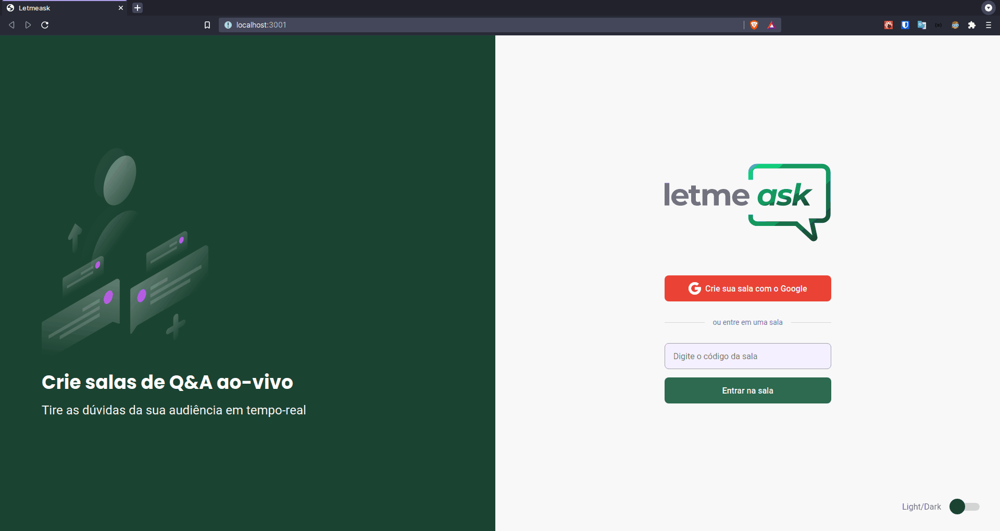
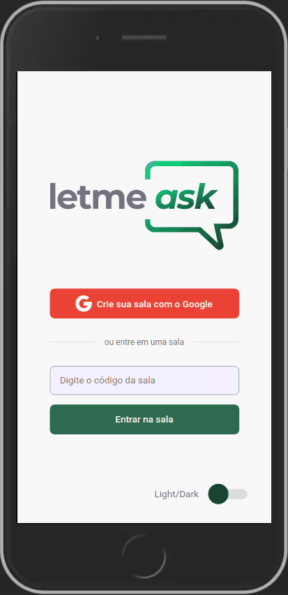

<h1 align="center">
  
</h1>

<p align="center">
  <a href="#-tecnologies">Tecnologies</a>&nbsp;&nbsp;&nbsp;|&nbsp;&nbsp;&nbsp;
  <a href="#-project">Project</a>&nbsp;&nbsp;&nbsp;|&nbsp;&nbsp;&nbsp;
  <a href="#-layout">Layout</a>&nbsp;&nbsp;&nbsp;|&nbsp;&nbsp;&nbsp;
  <a href="#memo-license">License</a>
</p>

<p align="center">
 

  
</p>

<br>

<h2 align="center">
  Application developed at Next Level Week # 6
</h2>

<br>

<h1 align="left"> 
  Your platform to answer your audience's questions
</h1>
<p align="left"> 
  🚀 Create live Q&A rooms.
</p>

## Indexes
* [About](#About)
* [Technologies](#Technologies)
* [Layout](#Layout)
* [Features](#Features)
* [How to install and use](#How-to-install-and-use)

## About
<p>
Letmeask is a platform that allows you to create live Q&A rooms to interact with your audience and solve their doubts, perfect for those who stream live.
</p>

<a href="https://application-letmeask.web.app/" target="_blank">Application link</a>

<p align="center"> 
  
  
</p>

## Technologies

- [React](https://pt-br.reactjs.org/)
- [TypeScript](https://www.typescriptlang.org/)
- [Firebase](http://firebase.google.com/)
- [Styled-components](https://styled-components.com/)
- [React-hot-toast](https://react-hot-toast.com/)

## Layout

You can view the project layout through the link below:

- [Layout Web](https://www.figma.com/file/u0BQK8rCf2KgzcukdRRCWh/Letmeask/duplicate) 

Remembering that you need to have an account at [Figma](http://figma.com/).

## Features

- [x] Room creation
- [x] Closing of rooms
- [x] Add new question
- [x] Remove a question
- [x] Highlight a question
- [x] Liked a question
- [x] Mark question as answered
- [x] Responsive for mobile devices
- [x] Theme switch function


## How to install and use

Before you begin, you will need to have the following tools installed on your machine: [Git](https://git-scm.com), [Node.js](https://nodejs.org/en/). 

In addition, it is good to have an editor to work with the code as [VSCode](https://code.visualstudio.com/).

```bash

# Clone this repository
$ git clone https://github.com/ewertonbn/letmeask-nlw

# Access the project folder in the cmd/terminal
$ cd letmeask-nlw

# Install the dependencies using npm or yarn
$ yarn or npm install

# Run the application in development mode
$ yarn dev or npm run dev

# The server will start at port:3000 - access  http://localhost:3000/

# Note: Change the env.example file with your settings after creating the application in firebase

```

## License

This project is under the MIT license. See the [LICENSE](LICENSE.md) file  for more details.

### Author
---

<a href="https://app.rocketseat.com.br/me/ewertonbn">
 
 <br />
 <sub><b>Ewerton Bernardo</b></sub></a> <a href="https://app.rocketseat.com.br/me/ewertonbn/" title="Rocketseat">🚀</a>


Made with ❤️ by Ewerton Bernardo 👋🏽 Let's connect! 

[](https://www.linkedin.com/in/ewertonbn/) 
[](mailto:ewertonbn.dev@gmail.com)